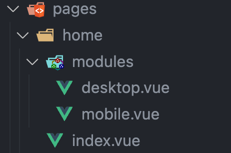

# 自定义路由

在 Nuxt 的约定式路由中，`pages` 文件夹下的组件都会生成对应的路由，但有时候我们希望将某些路由组件和独属于它的非路由组件放在一起，就可以使用下面的方法自定义路由，阻止这些非路由组件生成路由

## 目录结构

我们不希望 `modules` 文件夹内的组件生成路由



## 解决方案

### 1️⃣ definePageMeta

在 `desktop.vue` 和 `mobile.vue` 组件中通过 `definePageMeta` 来阻止生成路由

```vue
<script setup lang="ts">
definePageMeta({
  validate: async () => false,
})
</script>

<template>
  <div class="home">
    <h1>This is the home mobile page</h1>
  </div>
</template>
```

### 2️⃣ nuxtignore（最简单）

新建 `.nuxtignore` 文件

```bash
# 告诉 Nuxt 在构建阶段忽略哪些文件

# 指定 pages 文件夹下的 这些文件夹不生成路由
/pages/**/modules/**
/pages/**/components/**
/pages/**/configs/**
/pages/**/utils/**
```

### 3️⃣ 自定义路由

在 `nuxt.config.ts` 文件中使用钩子来自定义路由

```ts
// @ts-nocheck
// https://nuxt.com/docs/api/configuration/nuxt-config
import type { NuxtPage } from '@nuxt/schema'

export default defineNuxtConfig({
  /** 钩子 */
  hooks: {
    'pages:extend'(pages) {
      // 自定义添加路由
      // pages.push({
      //   name: 'profile',
      //   path: '/profile',
      //   file: '~/extra-pages/profile.vue',
      // })

      // 自定义移除路由
      function removePagesMatching(pattern: RegExp, pages: NuxtPage[] = []) {
        const pagesToRemove: NuxtPage[] = []
        for (const page of pages) {
          if (page.file && pattern.test(page.file)) {
            pagesToRemove.push(page)
          }
          else {
            removePagesMatching(pattern, page.children)
          }
        }
        for (const page of pagesToRemove) {
          pages.splice(pages.indexOf(page), 1)
        }
      }
      // 移除 /modules、/components、/configs、/utils 路由
      removePagesMatching(/\/(modules|components|configs|utils)\//, pages)
    },
  },
})
```