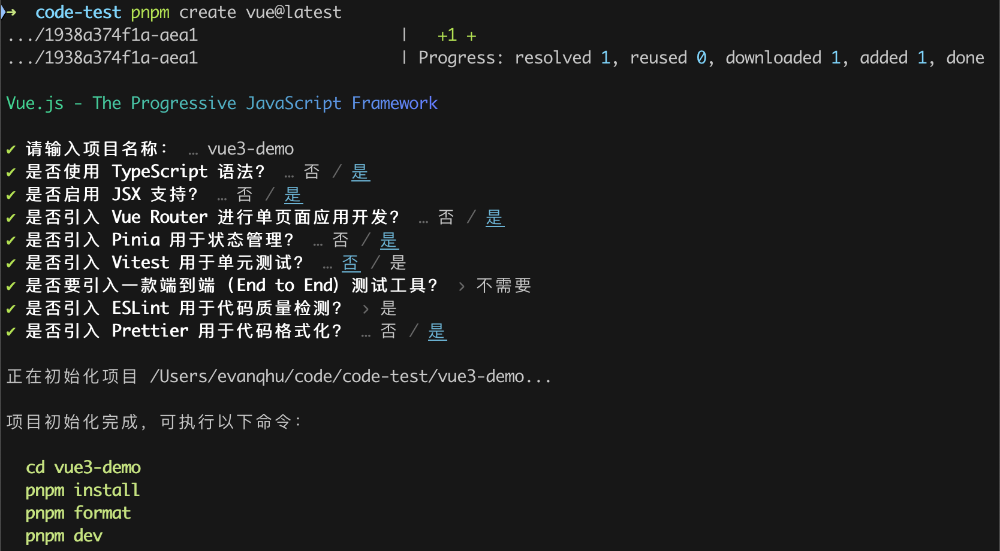
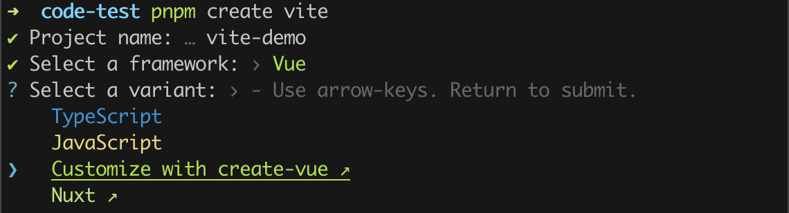
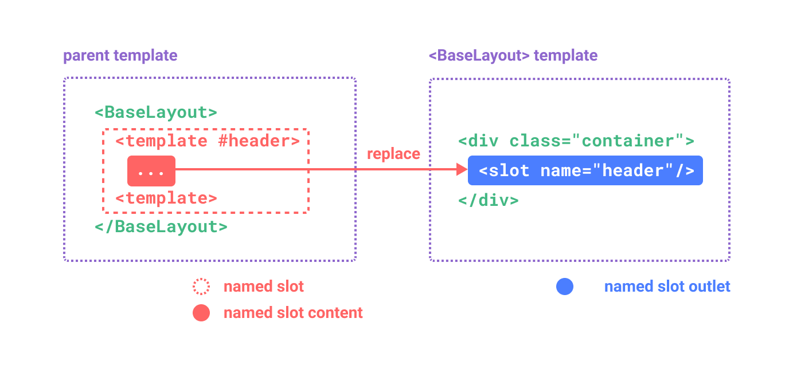

# Vue 关键知识

## 新建项目

### 1️⃣ 基于 [create-vue](https://github.com/vuejs/create-vue) 创建

`create-vue` 是 Vue 官方的项目脚手架工具。你将会看到一些诸如 TypeScript 和测试支持之类的可选功能提示：

```sh
pnpm create vue@latest
```



### 2️⃣ 基于 [create-vite](https://github.com/vitejs/vite/tree/main/packages/create-vite) 创建

`create-vite` 是 Vite 官方的项目脚手架工具。使用 Vite 创建项目时可以选择多种项目模板，包括 Vue、React、SSR 等等类型

```sh
## 执行创建命令
pnpm create vite
```


选择某个框架之后，还可以自定义模板，比如这里选择 Vue 框架，还可以通过 create-vue 来自定义模板，也可以选择 Nuxt 模板等



## 模板语法

### 同名简写

- 仅支持 3.4 版本及以上

如果 attribute 的名称与绑定的 JavaScript 值的名称相同，那么可以进一步简化语法，省略 attribute 值：

```html
<!-- 与 :id="id" 相同 -->
<div :id></div>

<!-- 这也同样有效 -->
<div v-bind:id></div>
```

### 布尔型 **Attribute**

[**布尔型 attribute**](https://developer.mozilla.org/zh-CN/docs/Web/HTML/Attributes#%E5%B8%83%E5%B0%94%E5%80%BC%E5%B1%9E%E6%80%A7)  依据 true / false 值来决定 attribute 是否应该存在于该元素上。[**`disabled`**](https://developer.mozilla.org/en-US/docs/Web/HTML/Attributes/disabled)  就是最常见的例子之一。

`v-bind`  在这种场景下的行为略有不同：

```html
<button :disabled="isButtonDisabled">Button</button>
```

当  `isButtonDisabled`  为[**真值**](https://developer.mozilla.org/en-US/docs/Glossary/Truthy)或一个空字符串 (即  `<button disabled="">`) 时，元素会包含这个  `disabled` attribute。而当其为其他[**假值**](https://developer.mozilla.org/en-US/docs/Glossary/Falsy)时 attribute 将被忽略。

> ⏰  注意：当布尔型 Attribute 的值为空字符串时，元素会包含这个 attribute，相当于这个 attribute 为 true；这和 JS 中的认知不同，这是 HTML5 中推荐的规范

### 动态绑定多个值

如果你有像这样的一个包含多个 attribute 的 JavaScript 对象：

```js
const objectOfAttrs = {
  id: "container",
  class: "wrapper",
  style: "background-color:green",
};
```

通过不带参数的  `v-bind`，你可以将它们绑定到单个元素上：

```html
<div v-bind="objectOfAttrs"></div>
```

### 指令 Directives

指令是带有  `v-`  前缀的特殊 attribute。Vue 提供了许多[**内置指令**](https://cn.vuejs.org/api/built-in-directives.html)，包括上面我们所介绍的  `v-bind`  和  `v-html`。

指令 attribute 的期望值为一个 JavaScript 表达式 (除了少数几个例外，即之后要讨论到的  `v-for`、`v-on`  和  `v-slot`)。一个指令的任务是在其表达式的值变化时响应式地更新 DOM。以  [**`v-if`**](https://cn.vuejs.org/api/built-in-directives.html#v-if)  为例：

```html
<p v-if="seen">Now you see me</p>
```

这里，`v-if`  指令会基于表达式  `seen`  的值的真假来移除/插入该  `<p>`  元素。

### 参数 **Arguments**

某些指令会需要一个“参数”，在指令名后通过一个冒号隔开做标识。例如用  `v-bind`  指令来响应式地更新一个 HTML attribute：

```html
<a v-bind:href="url"> ... </a>

<!-- 简写 -->
<a :href="url"> ... </a>
```

这里  `href`  就是一个参数，它告诉  `v-bind`  指令将表达式  `url`  的值绑定到元素的  `href` attribute 上。在简写中，参数前的一切 (例如  `v-bind:`) 都会被缩略为一个  `:`  字符。

另一个例子是  `v-on`  指令，它将监听 DOM 事件：

```html
<a v-on:click="doSomething"> ... </a>

<!-- 简写 -->
<a @click="doSomething"> ... </a>
```

这里的参数是要监听的事件名称：`click`。`v-on`  有一个相应的缩写，即  `@`  字符。

> ⏰  注意：要搞清楚 attribute 和 arguments 直接两个定义

### 动态参数

同样在指令参数上也可以使用一个 JavaScript 表达式，需要包含在一对方括号内

```html
<a v-bind:[attributeName]="url"> ... </a>

<a v-on:[eventName]="doSomething"> ... </a>
```

这里的 `attributeName` 和 `eventName` 可以是表达式，动态值

### 修饰符 **Modifiers**

修饰符是以点开头的特殊后缀，表明指令需要以一些特殊的方式被绑定。例如  `.prevent`  修饰符会告知  `v-on`  指令对触发的事件调用  `event.preventDefault()`：

```html
<form @submit.prevent="onSubmit">...</form>
```

指令语法：

- 指令名 `v-on`
- 参数 `submit`
- 修饰符 `.prevent`
- 值 `onSubmit`


### CSS 中的 `v-bind()`

单文件组件的 `<style>` 标签支持使用 `v-bind` CSS 函数将 CSS 的值链接到动态的组件状态：

```vue
<template>
  <div class="text">hello</div>
</template>

<script>
export default {
  data() {
    return {
      color: "red",
    };
  },
};
</script>

<style>
.text {
  color: v-bind(color);
}
</style>
```

这个语法同样也适用于 `<script setup>`，且支持 JavaScript 表达式 (需要用引号包裹起来)：

```vue
<script setup>
import { ref } from "vue";
const theme = ref({
  color: "red",
});
</script>

<template>
  <p>hello</p>
</template>

<style scoped>
p {
  color: v-bind("theme.color");
}
</style>
```

## 响应式基础

### 有状态的方法 (选项式)

在某些情况下，我们可能需要动态地创建一个方法函数，比如创建一个预置防抖的事件处理器：

```js
import { debounce } from "lodash-es";

export default {
  methods: {
    // 使用 Lodash 的防抖函数
    click: debounce(function () {
      // ... 对点击的响应 ...
    }, 500),
  },
};
```

不过这种方法对于被重用的组件来说是有问题的，因为这个预置防抖的函数是**有状态的**：它在运行时维护着一个内部状态。如果多个组件实例都共享这同一个预置防抖的函数，那么它们之间将会互相影响。

要保持每个组件实例的防抖函数都彼此独立，我们可以改为在  `created`  生命周期钩子中创建这个预置防抖的函数：

```js
export default {
  created() {
    // 每个实例都有了自己的预置防抖的处理函数
    this.debouncedClick = _.debounce(this.click, 500);
  },
  unmounted() {
    // 最好是在组件卸载时
    // 清除掉防抖计时器
    this.debouncedClick.cancel();
  },
  methods: {
    click() {
      // ... 对点击的响应 ...
    },
  },
};
```

### `reactive()` 的局限性

1. 有限的值类型：它只能用于对象类型 (对象、数组和如  `Map`、`Set`  这样的[**集合类型**](https://developer.mozilla.org/en-US/docs/Web/JavaScript/Reference/Global_Objects#keyed_collections))。它不能持有如  `string`、`number`  或  `boolean`  这样的[**原始类型**](https://developer.mozilla.org/en-US/docs/Glossary/Primitive)。
2. 不能替换整个对象：由于 Vue 的响应式跟踪是通过属性访问实现的，因此我们必须始终保持对响应式对象的相同引用。这意味着我们不能轻易地“替换”响应式对象，因为这样的话与第一个引用的响应性连接将丢失：

```js
let state = reactive({ count: 0 });

// 上面的 ({ count: 0 }) 引用将不再被追踪
// (响应性连接已丢失！)
state = reactive({ count: 1 });
```

3. 对解构操作不友好：当我们将响应式对象的原始类型属性解构为本地变量时，或者将该属性传递给函数时，我们将丢失响应性连接：

```js
const state = reactive({ count: 0 });

// 当解构时，count 已经与 state.count 断开连接
let { count } = state;
// 不会影响原始的 state
count++;

// 该函数接收到的是一个普通的数字
// 并且无法追踪 state.count 的变化
// 我们必须传入整个对象以保持响应性
callSomeFunction(state.count);
```

> 由于这些限制，我们建议使用  `ref()`  作为声明响应式状态的主要 API。

### 额外的 ref 解包细节

一个 ref 会在作为响应式对象的属性被访问或修改时自动解包。换句话说，它的行为就像一个普通的属性：

```js
const count = ref(0);
const state = reactive({
  count,
});

console.log(state.count); // 0

state.count = 1;
console.log(count.value); // 1
```

如果将一个新的 ref 赋值给一个关联了已有 ref 的属性，那么它会替换掉旧的 ref：

```js
const otherCount = ref(2);

state.count = otherCount;
console.log(state.count); // 2
// 原始 ref 现在已经和 state.count 失去联系
console.log(count.value); // 1
```

只有当嵌套在一个深层响应式对象内时，才会发生 ref 解包。当其作为[**浅层响应式对象**](https://cn.vuejs.org/api/reactivity-advanced.html#shallowreactive)的属性被访问时不会解包。

> 参考 https://cn.vuejs.org/guide/essentials/reactivity-fundamentals.html#additional-ref-unwrapping-details

## 计算属性

### 计算属性缓存 vs 方法

我们将同样的函数定义为一个方法而不是计算属性，两种方式在结果上确实是完全相同的，然而，不同之处在于**计算属性值会基于其响应式依赖被缓存**。相比之下，方法调用**总是**会在重渲染发生时再次执行函数。

### 可写计算属性

计算属性默认是只读的。当你尝试修改一个计算属性时，你会收到一个运行时警告。只在某些特殊场景中你可能才需要用到“可写”的属性，你可以通过同时提供 getter 和 setter 来创建。

```js
import { ref, computed } from "vue";

const firstName = ref("John");
const lastName = ref("Doe");

const fullName = computed({
  // getter
  get() {
    return firstName.value + " " + lastName.value;
  },
  // setter
  set(newValue) {
    // 注意：我们这里使用的是解构赋值语法
    [firstName.value, lastName.value] = newValue.split(" ");
  },
});
```

## 类和样式绑定

数据绑定的一个常见需求场景是操纵元素的 CSS class 列表和内联样式。因为  `class`  和  `style`  都是 attribute，我们可以和其他 attribute 一样使用  `v-bind`  将它们和动态的字符串绑定。但是，在处理比较复杂的绑定时，通过拼接生成字符串是麻烦且易出错的。因此，Vue 专门为  `class`  和  `style`  的  `v-bind`  用法提供了特殊的功能增强。**除了字符串外，表达式的值也可以是对象或数组**。

### 绑定 HTML class

> `errorClass`  会一直存在，但  `activeClass`  只会在  `isActive`  为真时才存在。

```html
<!-- 方案 1 -->
<div :class="[isActive ? activeClass : '', errorClass]"></div>

<!-- 方案 2：数组中嵌套对象 -->
<div :class="[{ [activeClass]: isActive }, errorClass]"></div>
```

### 在组件中使用

对于只有一个根元素的组件，当你使用了  `class` attribute 时，这些 class 会被添加到根元素上并与该元素上已有的 class 合并。

举例来说，如果你声明了一个组件名叫  `MyComponent`，模板如下：

```html
<!-- 子组件模板 -->
<p class="foo bar">Hi!</p>
```

在使用时添加一些 class：

```html
<!-- 在使用组件时 -->
<MyComponent class="baz boo" />
```

渲染出的 HTML 为：

```html
<p class="foo bar baz boo">Hi!</p>
```

## 条件渲染

### v-if

> 一个  `v-else`  元素必须跟在一个  `v-if`  或者  `v-else-if`  元素后面，否则它将不会被识别

因为  `v-if`  是一个指令，他必须依附于某个元素。但如果我们想要切换不止一个元素呢？在这种情况下我们可以在一个  `<template>`  元素上使用  `v-if`，这只是一个不可见的包装器元素，最后渲染的结果并不会包含这个  `<template>`  元素。

### v-show

> `v-show`  会在 DOM 渲染中保留该元素；`v-show`  仅切换了该元素上名为  `display`  的 CSS 属性。
> `v-show`  不支持在  `<template>`  元素上使用，也不能和  `v-else`  搭配使用。

## 列表渲染

> 使用  `of`  或  `in` 作为分隔符均可，效果一样

### 遍历数组

```html
<li v-for="(item, index) in items" :key="index">{{ index }} - {{ item }}</li>
```

第一个参数 `item` 是遍历数组的项，第二个参数 `index` 是当前项的位置索引

### 遍历对象

```html
<li v-for="(value, key, index) in myObject">{{ index }}. {{ key }}: {{ value }}</li>
```

第一个参数 `value` 是遍历对象的属性值，第二个参数 `key` 表示属性名，第三个参数 `index` 表示位置索引

### 使用范围值

`v-for`  可以直接接受一个整数值。在这种用例中，会将该模板基于  `1...n`  的取值范围重复多次。

```html
<span v-for="n in 10">{{ n }}</span>
```

> 注意此处  `n`  的初值是从  `1`  开始而非  `0`。

### 组件上使用 v-for

我们可以直接在组件上使用  `v-for`，和在一般的元素上使用没有区别，但是，这不会自动将任何数据传递给组件，因为组件有自己独立的作用域。为了将迭代后的数据传递到组件中，我们还需要传递 props：

```html
<MyComponent v-for="(item, index) in items" :item="item" :index="index" :key="item.id" />
```

### v-for 与 v-if

同时使用 v-if 和 v-for 是不推荐的，因为这样二者的优先级不明显。

当它们同时存在于一个节点上时，v-if 比 v-for 的优先级更高。这意味着 v-if 的条件将无法访问到 v-for 作用域内定义的变量别名：

```html
<!--
 这会抛出一个错误，因为属性 todo 此时
 没有在该实例上定义
-->
<li v-for="todo in todos" v-if="!todo.isComplete">{{ todo.name }}</li>
```

在外先包装一层 `<template>` 再在其上使用 v-for 可以解决这个问题 (这也更加明显易读)：

```html
<template v-for="todo in todos">
  <li v-if="!todo.isComplete">{{ todo.name }}</li>
</template>
```

## 事件处理

### 内联事件处理器

```html
<button @click="count++">Add 1</button>
```

> `foo()`  和  `count++`  `() ⇒ {}` 会被视为内联事件处理器

**在内联处理器中调用方法**

```html
<button @click="say('hello')">Say hello</button> <button @click="say('bye')">Say bye</button>
```

```js
methods: {
  say(message) {
    alert(message)
  }
}
```

**在内联处理器中访问事件参数**

```html
<!-- 使用特殊的 $event 变量 -->
<button @click="warn('Form cannot be submitted yet.', $event)">Submit</button>

<!-- 使用内联箭头函数 -->
<button @click="(event) => warn('Form cannot be submitted yet.', event)">Submit</button>
```

```js
methods: {
  warn(message, event) {
    // 这里可以访问 DOM 原生事件
    if (event) {
      event.preventDefault()
    }
    alert(message)
  }
}
```

### 方法事件处理器

```html
<!-- `greet` 是上面定义过的方法名 -->
<button @click="greet">Greet</button>
```

> `foo`、`foo.bar`  和  `foo['bar']`  会被视为方法事件处理器

方法事件处理器会自动接收原生 DOM 事件并触发执行。在上面的例子中，我们能够通过被触发事件的  `event.target`  访问到该 DOM 元素。

```js
methods: {
  greet(event) {
    // 方法中的 `this` 指向当前活跃的组件实例
    alert(`Hello ${this.name}!`)
    // `event` 是 DOM 原生事件
    if (event) {
      alert(event.target.tagName)
    }
  }
}
```

## 表单输入绑定

也就是我们常说的双向绑定，`v-model`

1️⃣ 手动连接值绑定和更改事件监听器

```html
<input :value="text" @input="event => text = event.target.value" />
```

2️⃣ `v-model` 指令

```html
<input v-model="text" />
```

> **`v-model`  会忽略任何表单元素上初始的  `value`、`checked`  或  `selected` attribute。它将始终将当前绑定的 JavaScript 状态视为数据的正确来源。**

### 多行文本

```html
<span>Multiline message is:</span>
<p style="white-space: pre-line;">{{ message }}</p>
<textarea v-model="message" placeholder="add multiple lines"></textarea>
```

`white-space: pre-line` 的意思是：

- 保留换行符：元素内的换行符会被保留，即文本会按照源代码中的换行位置进行换行。
- 合并连续空格：连续的空格会被合并为一个空格。

### textarea

在  `<textarea>`  中是不支持插值表达式的。请使用  `v-model`  来替代

```html
<!-- 错误 -->
<textarea>{{ text }}</textarea>

<!-- 正确 -->
<textarea v-model="text"></textarea>
```

> 原生的 `<textarea>`  标签体中的内容是默认输入内容，不支持 `value` 属性

## 生命周期

每个 Vue 组件实例在创建时都需要经历一系列的初始化步骤，比如设置好数据侦听，编译模板，挂载实例到 DOM，以及在数据改变时更新 DOM。在此过程中，它也会运行被称为生命周期钩子的函数，让开发者有机会在特定阶段运行自己的代码。


## 侦听器 watch

计算属性允许我们声明性地计算衍生值。然而在有些情况下，我们需要在状态变化时执行一些“副作用”：例如更改 DOM，或是根据异步操作的结果去修改另一处的状态。

watch 的第一个参数可以是不同形式的“数据源”：它可以是：

- 一个 ref (包括计算属性)
- 一个响应式对象 reactive
- 一个 getter 函数 `() => value`
- 以上多个数据源组成的数组

::: warning
注意，你不能直接侦听响应式对象的属性值，例如:
:::

```js
const obj = reactive({ count: 0 });

// 错误，因为 watch() 得到的参数是一个 number
watch(obj.count, (count) => {
  console.log(`Count is: ${count}`);
});
```

这里需要用一个返回该属性的 getter 函数：

```js
// 提供一个 getter 函数
watch(
  () => obj.count,
  (count) => {
    console.log(`Count is: ${count}`);
  }
);
```

### 回调的出发时机

默认情况下，侦听器回调会在父组件更新 (如有) **之后**、所属组件的 DOM 更新**之前**被调用。这意味着如果你尝试在侦听器回调中访问所属组件的 DOM，那么 DOM 将处于更新前的状态。

### 使用命令式创建侦听器

```js
created() {
    this.$watch('question', (newQuestion) => {
      // ...
    })
  }
```

### 停止侦听器

```js
const unwatch = this.$watch("foo", callback);

// ...当该侦听器不再需要时
unwatch();
```

### V3 侦听数据源类型

- 一个 ref 对象
- 一个 reactive 对象
- 一个 getter 函数
- 以上多个数据源组成的数组

## 模板引用

`ref`  是一个特殊的 attribute，它允许我们在一个特定的 DOM 元素或子组件实例**被挂载后**，获得对它的直接引用，挂载结束后引用都会被暴露在  `this.$refs`  之上。

当在  `v-for`  中使用模板引用时，相应的引用中包含的值是一个数组，ref 数组**并不**保证与源数组相同的顺序

```html
<ul>
  <li v-for="item in list" ref="items">{{ item }}</li>
</ul>
```

- `ref` 使用在 DOM 元素上时，获得是真实 DOM 元素
- `ref` 使用在 组件标签上时，获得是组件实例

### 组合式 API 中使用模板引用

- Vue 3.5 以前

```vue
<script setup>
import { ref, onMounted } from "vue";

// 声明一个 ref 来存放该元素的引用；必须和模板里的 ref 同名（这里就将模板引用和响应式变量混用了，不太好）
const input = ref(null);

onMounted(() => {
  input.value.focus();
});
</script>

<template>
  <input ref="input" />
</template>
```

- Vue 3.5 以后

```vue
<script setup>
import { useTemplateRef, onMounted } from "vue";

// 第一个参数必须与模板中的 ref 值匹配
const input = useTemplateRef("my-input");

onMounted(() => {
  input.value.focus();
});
</script>

<template>
  <input ref="my-input" />
</template>
```

使用了  `<script setup>`  的组件是**默认私有**的：一个父组件无法访问到一个使用了  `<script setup>`  的子组件中的任何东西，除非子组件在其中通过  `defineExpose`  宏显式暴露

```html
<script setup>
  import { ref } from "vue";

  const a = 1;
  const b = ref(2);

  // 像 defineExpose 这样的编译器宏不需要导入
  defineExpose({
    a,
    b,
  });
</script>
```

### 类型标注

为了获取导入组件的实例类型，我们需要先通过  `typeof`  获取其类型，然后使用 TypeScript 的内置  `InstanceType`  工具提取其实例类型：

```vue
<!-- App.vue -->
<script setup lang="ts">
import { useTemplateRef } from "vue";
import Foo from "./Foo.vue";
import Bar from "./Bar.vue";

type FooType = InstanceType<typeof Foo>;
type BarType = InstanceType<typeof Bar>;

const compRef = useTemplateRef<FooType | BarType>("comp");
</script>

<template>
  <component :is="Math.random() > 0.5 ? Foo : Bar" ref="comp" />
</template>
```

## 组件基础

### 动态组件

```html
<!-- currentTab 改变时组件也改变 -->
<component :is="currentTab"></component>
```

被传给  `:is`  的值可以是以下几种：

- 被注册的组件名
- 导入的组件对象
- 异步组件
- 内置的 HTML 标签

```html
<!-- 组件名称 -->
<template>
  <component :is="currentComponent"></component>
</template>

<script>
  import MyComponentA from "./MyComponentA.vue";
  import MyComponentB from "./MyComponentB.vue";

  export default {
    components: {
      MyComponentA,
      MyComponentB,
    },
    data() {
      return {
        currentComponent: "MyComponentA", // 动态切换到 MyComponentA 或 MyComponentB
      };
    },
  };
</script>

<!-- 组件对象 -->
<template>
  <component :is="currentComponent"></component>
</template>

<script>
  import MyComponentA from "./MyComponentA.vue";
  import MyComponentB from "./MyComponentB.vue";

  export default {
    data() {
      return {
        currentComponent: MyComponentA, // 动态切换组件
      };
    },
  };
</script>

<!-- 异步组件 -->
<template>
  <component :is="currentComponent"></component>
</template>

<script>
  export default {
    data() {
      return {
        currentComponent: () => import("./MyComponentA.vue"), // 异步加载组件
      };
    },
  };
</script>

<!-- 内置的 HTML 标签 -->
<template>
  <component :is="currentTag">Hello World</component>
</template>

<script>
  export default {
    data() {
      return {
        currentTag: "div", // 动态渲染 div 或其他 HTML 标签
      };
    },
  };
</script>
```

当使用  `<component :is="...">`  来在多个组件间作切换时，被切换掉的组件会被卸载。我们可以通过  [**`<KeepAlive>`  组件**](https://cn.vuejs.org/guide/built-ins/keep-alive.html)强制被切换掉的组件仍然保持“存活”的状态。

## 组件注册

局部注册和全局注册

全局注册时没有被使用的组件无法在生产打包时被自动移除 (也叫“tree-shaking”)

使用 `Vue.component()` 或 `app.component()` 全局注册组件

```js
import MyComponent from "./App.vue";

app.component("MyComponent", MyComponent);
```

在使用 `<script setup>` 的单文件组件中，导入的组件可以直接在模板中使用，无需注册：

```vue
<script setup>
import ComponentA from "./ComponentA.vue";
</script>

<template>
  <ComponentA />
</template>
```

如果没有使用 `<script setup>`，则需要使用 components 选项来显式注册：

```js
import ComponentA from "./ComponentA.js";

export default {
  components: {
    ComponentA,
  },
  setup() {
    // ...
  },
};
```

## Props

### 使用一个对象绑定多个 prop

如果你想要将一个对象的所有属性都当作 props 传入，你可以使用[**没有参数的  `v-bind`**](https://cn.vuejs.org/guide/essentials/template-syntax.html#dynamically-binding-multiple-attributes)，即只使用  `v-bind`  而非  `:prop-name`。

```js
export default {
  data() {
    return {
      post: {
        id: 1,
        title: "My Journey with Vue",
      },
    };
  },
};
```

```js
<BlogPost v-bind="post" />
// 等价于
<BlogPost :id="post.id" :title="post.title" />
```

### 组合式 API 中使用 Props

- 使用  `<script setup>`  的单文件组件

```js
// 字符串数组
const props = defineProps(['foo'])

// 对象
const props = defineProps({
  foo: String // 这里的 String 是构造函数，不是类型
})

// 实践中通常使用函数泛型的写法，可单独将泛型定义为 interface
<script setup lang="ts">
defineProps<{
  title?: string
  likes?: number
}>()
</script>

// 指定默认值
const props = withDefaults(defineProps<{ list: PersonList }>(), {
   list: () => [{ id: 'abcd01', name: '小猪佩奇', age: 18 }]
  })
```

- 没有使用  `<script setup>`  的组件

```js
export default {
  props: ["foo"],
  setup(props) {
    // setup() 接收 props 作为第一个参数
    console.log(props.foo);
  },
};
```

### 响应式 Props 解构

```js
const { foo } = defineProps(["foo"]);

watchEffect(() => {
  // 在 3.5 之前只运行一次
  // 在 3.5+ 中在 "foo" prop 变化时重新执行
  console.log(foo);
});
```

在 3.4 及以下版本，`foo`  是一个实际的常量，永远不会改变。在 3.5 及以上版本，当在同一个  `<script setup>`  代码块中访问由  `defineProps`  解构的变量时，Vue 编译器会自动在前面添加  `props.`。

```js
const props = defineProps(["foo"]);

watchEffect(() => {
  // `foo` 由编译器转换为 `props.foo`
  console.log(props.foo);
});
```

此外，你可以使用 JavaScript 原生的默认值语法声明 props 默认值。

```js
const { foo = 'hello' } = defineProps<{ foo?: string }>()
```

### 将解构的 props 传递到函数中

当我们将解构的 prop 传递到函数中时，例如：

```js
const { foo } = defineProps(["foo"]);

watch(foo /* ... */);
```

这并不会按预期工作，因为它等价于 `watch(props.foo, ...)`——我们给 watch 传递的是一个值而不是响应式数据源。实际上，Vue 的编译器会捕捉这种情况并发出警告。

与使用 `watch(() => props.foo, ...)` 来侦听普通 prop 类似，我们也可以通过将其包装在 getter 中来侦听解构的 prop：

```js
watch(() => foo /* ... */);
```

### Props 解构默认值

当使用基于类型的声明时，我们失去了为 props 声明默认值的能力。可以通过使用响应式 Props 解构解决这个问题。 (3.5+)

```typescript
interface Props {
  msg?: string;
  labels?: string[];
}

const { msg = "hello", labels = ["one", "two"] } = defineProps<Props>();
```

在 3.4 及更低版本，响应式 Props 解构不会被默认启用。另一种选择是使用 withDefaults 编译器宏：

```typescript
interface Props {
  msg?: string;
  labels?: string[];
}

const props = withDefaults(defineProps<Props>(), {
  msg: "hello",
  labels: () => ["one", "two"],
});
```

## 事件

### 声明触发的事件

- 选项式

```js
export default {
  emits: ["inFocus", "submit"],
};
```

- 组合式

我们在  `<template>`  中使用的  `$emit`  方法不能在组件的  `<script setup>`  部分中使用，但  `defineEmits()`  会返回一个相同作用的函数供我们使用

```vue
<script setup>
const emit = defineEmits(["inFocus", "submit"]);
function buttonClick() {
  emit("submit");
}
</script>
```

```js
export default {
  emits: ["inFocus", "submit"],
  setup(props, ctx) {
    ctx.emit("submit");
  },
};
```

### 事件校验

要为事件添加校验，那么事件可以被赋值为一个函数，接受的参数就是抛出事件时传入  `emit`  的内容，返回一个布尔值来表明事件是否合法。

```js
export default {
  emits: {
    // 没有校验
    click: null,

    // 校验 submit 事件
    submit: ({ email, password }) => {
      if (email && password) {
        return true;
      } else {
        console.warn("Invalid submit event payload!");
        return false;
      }
    },
  },
  methods: {
    submitForm(email, password) {
      this.$emit("submit", { email, password });
    },
  },
};
```

## 组件 v-model

### 在原生元素上使用

```html
<input v-model="searchText" />
<!-- 相当于 -->
<input :value="searchText" @input="searchText = $event.target.value" />
```

Vue 3.4 之后

```html
<script setup>
  const model = defineModel();
</script>

<template>
  <input v-model="model" />
</template>
```

### 在组件上使用 v-model

下面两种实现方式均可

```html
<!-- CustomInput.vue -->
<script>
  export default {
    props: ["modelValue"],
    emits: ["update:modelValue"],
  };
</script>

<template>
  <input :value="modelValue" @input="$emit('update:modelValue', $event.target.value)" />
</template>
```

```html
<!-- CustomInput.vue -->
<script>
  export default {
    props: ["modelValue"],
    emits: ["update:modelValue"],
    computed: {
      value: {
        get() {
          return this.modelValue;
        },
        set(value) {
          this.$emit("update:modelValue", value);
        },
      },
    },
  };
</script>

<template>
  <input v-model="value" />
</template>
```

### 组合式 API 中的 v-model

从 Vue 3.4 开始，推荐的实现方式是使用  [**`defineModel()`**](https://cn.vuejs.org/api/sfc-script-setup.html#definemodel)  宏：

```html
<!-- Child.vue -->
<script setup>
  const model = defineModel();

  function update() {
    model.value++;
  }
</script>

<template>
  <div>Parent bound v-model is: {{ model }}</div>
  <button @click="update">Increment</button>
</template>
```

```html
<!-- Parent.vue -->
<Child v-model="countModel" />
```

```js
// 使 v-model 必填
const model = defineModel({ required: true });

// 提供一个默认值
const model = defineModel({ default: 0 });
```

## 透传 Attributes

“透传 attribute”指的是传递给一个组件，却没有被该组件声明为  [**props**](https://cn.vuejs.org/guide/components/props.html)  或  [**emits**](https://cn.vuejs.org/guide/components/events.html#defining-custom-events)  的 attribute 或者  `v-on`  事件监听器。最常见的例子就是  `class`、`style`  和  `id`。

### **禁用 Attributes 继承**

如果你**不想要**一个组件自动地继承 attribute，你可以在组件选项中设置  `inheritAttrs: false`。

从 3.3 开始你也可以直接在  `<script setup>`  中使用  [**`defineOptions`**](https://cn.vuejs.org/api/sfc-script-setup.html#defineoptions)：

> `defineOptions` 这个宏可以用来直接在  `<script setup>`  中声明组件选项，而不必使用单独的  `<script>`  块

```js
<script setup>
defineOptions({
  name: "ComponentName",
  inheritAttrs: false
})
// ...setup 逻辑
</script>
```

### 多根节点的继承

和单根节点组件有所不同，有着多个根节点的组件没有自动 attribute 透传行为。如果  `$attrs`  没有被显式绑定，将会抛出一个运行时警告。

### 在 JS 中访问透传属性

- 选项式

```js
export default {
  created() {
    console.log(this.$attrs);
  },
};
```

- 组合式

```vue
<!-- 使用 setup 语法糖 -->
<script setup>
import { useAttrs } from "vue";
const attrs = useAttrs();
</script>
```

```js
// 不使用 setup 语法糖
export default {
  setup(props, ctx) {
    // 透传 attribute 被暴露为 ctx.attrs
    console.log(ctx.attrs);
  },
};
```

## 插槽

插槽可以理解为**父组件传递对象**和**子组件调用函数**

> 😀 父组件中写在子组件标签体中的内容是一个对象，对象里面有插槽属性，属性值是一个函数

```vue
<!-- 父组件 -->
<template>
  <ChildComp>
    <p>default slot</p>

    <template v-slot:slot1>
      <p>slot1</p>
    </template>

    <template v-slot:slot2="{ msg }">
      <p>slot2: {{ msg }}</p>
    </template>
  </ChildComp>
</template>
```

```js
// 抽象
const obj = {
  // 默认插槽
  default: function () {
    return "<p>default slot</p>";
  },
  // 具名插槽
  slot1: function () {
    return "<p>slot1</p>";
  },
  // 作用域插槽
  slot2: function ({ msg }) {
    return "<p>slot2: {{ msg }}</p>";
  },
};
```

> 子组件中通过书写 `<slot>` 标签调用相应的函数，返回对应的虚拟节点

```vue
<!-- 子组件 -->
<template>
  <div>
    <slot></slot>
    <!-- 调用 default 函数 -->

    <slot name="slot1"></slot>
    <!-- 调用 slot1 函数 -->

    <slot name="slot2" msg="hello world"></slot>
    <!-- 调用 slot2 函数，参数为 "hello world" -->
  </div>
</template>
```

::: info

- **Props** 使得组件可以接收任意 **JavaScript 值**
- **插槽 Slot** 使得组件可以接收**模板内容**
  :::

```html
<FancyButton>
  <!-- 插槽内容 -->
  Click me!
</FancyButton>
```

```html
<!-- FancyButton.vue -->
<button class="fancy-btn">
  <!-- 插槽出口 -->
  <slot></slot>
</button>
```

`<slot>`  元素是一个**插槽出口** (slot outlet)，标示了父元素提供的**插槽内容** (slot content) 将在哪里被渲染。


### 插槽默认内容

```html
<button type="submit">
  <slot>
    <!-- 默认内容 -->
    Submit
  </slot>
</button>
```

### 具名插槽

```html
<div class="container">
  <header>
    <slot name="header"></slot>
  </header>
  <main>
    <slot></slot>
  </main>
  <footer>
    <slot name="footer"></slot>
  </footer>
</div>
```

这类带  `name`  的插槽被称为具名插槽 (named slots)。没有提供 `name`  的  `<slot>`  出口会隐式地命名为 `default`。

要为具名插槽传入内容，我们需要使用一个含  `v-slot`  指令的  `<template>`  元素，并将目标插槽的名字传给该指令：

```html
<BaseLayout>
  <template v-slot:header>
    <!-- header 插槽的内容放这里 -->
  </template>
</BaseLayout>

<BaseLayout>
  <template #header>
    <!-- header 插槽的内容放这里 -->
  </template>
</BaseLayout>
```

`v-slot`  有对应的简写  `#`，因此  `<template v-slot:header>`  可以简写为  `<template #header>`。其意思就是“将这部分模板片段传入子组件的 header 插槽中”。



### 条件插槽

根据插槽是否存在来渲染某些内容

```vue
<template>
  <div class="card">
    <div v-if="$slots.header" class="card-header">
      <slot name="header" />
    </div>

    <div v-if="$slots.default" class="card-content">
      <slot />
    </div>

    <div v-if="$slots.footer" class="card-footer">
      <slot name="footer" />
    </div>
  </div>
</template>
```

### 作用域插槽

我们需要一种方法来让子组件在渲染时将一部分数据提供给插槽，可以像对组件传递 props 那样，向一个插槽的出口上传递 attributes

```html
<!-- <MyComponent> 的模板 -->
<div>
  <slot :text="greetingMessage" :count="1"></slot>
</div>
```

当需要接收插槽 props 时，通过子组件标签上的 `v-slot` 指令，直接接收到了一个插槽 props 对象

```html
<MyComponent v-slot="slotProps">
  <div>{{ slotProps.text }}</div>
  <div>{{ slotProps.count }}</div>
</MyComponent>
```


## 依赖注入

### 选项式

#### 提供数据

```js
import { computed } from "vue";

export default {
  data() {
    return {
      message: "hello!",
    };
  },
  provide() {
    return {
      // 显式提供一个计算属性，保持响应式
      message: computed(() => this.message),
    };
  },
};
```

除了在一个组件中提供依赖，我们还可以在整个应用层面提供依赖

```js
import { createApp } from "vue";

const app = createApp({});

app.provide(/* 注入名 */ "message", /* 值 */ "hello!");
```

#### 接收数据

注入会在组件自身的状态**之前**被解析，因此你可以在  `data()`  中访问到注入的属性：

```js
export default {
  inject: ["message"],
  data() {
    return {
      // 基于注入值的初始数据
      fullMessage: this.message,
    };
  },
};
```

注入默认值

```js
export default {
  // 当声明注入的默认值时
  // 必须使用对象形式
  inject: {
    message: {
      from: "message", // 当与原注入名同名时，这个属性是可选的
      default: "default value",
    },
    user: {
      // 对于非基础类型数据，如果创建开销比较大，或是需要确保每个组件实例
      // 需要独立数据的，请使用工厂函数
      default: () => ({ name: "John" }),
    },
  },
};
```

### 组合式 API

#### 提供数据

```vue
<script setup>
import { provide } from "vue";

provide(/* 注入名 */ "message", /* 值 */ "hello!");
</script>
```

#### 接收数据

```vue
<script setup>
import { inject } from "vue";

const message = inject("message");
</script>
```

注入默认值

```js
// 如果没有祖先组件提供 "message"
// `value` 会是 "这是默认值"
const value = inject("message", "这是默认值");
```

## 异步组件

从服务器获取组件

```js
import { defineAsyncComponent } from "vue";

const AsyncComp = defineAsyncComponent(() => {
  return new Promise((resolve, reject) => {
    // ...从服务器获取组件
    resolve(/* 获取到的组件 */);
  });
});
// ... 像使用其他一般组件一样使用 `AsyncComp`
```

ES 模块动态导入组件

```js
import { defineAsyncComponent } from "vue";

const AsyncComp = defineAsyncComponent(() => import("./components/MyComponent.vue"));
```

## 组合式函数

在 Vue 应用的概念中，“组合式函数”(Composables) 是一个利用 Vue 的组合式 API 来封装和复用有状态逻辑的函数。

### 鼠标跟踪器示例

```js
// useMouse.js
import { ref, onMounted, onUnmounted } from "vue";

// 按照惯例，组合式函数名以“use”开头
export function useMouse() {
  // 被组合式函数封装和管理的状态
  const x = ref(0);
  const y = ref(0);

  // 组合式函数可以随时更改其状态。
  function update(event) {
    x.value = event.pageX;
    y.value = event.pageY;
  }

  // 一个组合式函数也可以挂靠在所属组件的生命周期上
  // 来启动和卸载副作用
  onMounted(() => window.addEventListener("mousemove", update));
  onUnmounted(() => window.removeEventListener("mousemove", update));

  // 通过返回值暴露所管理的状态
  return { x, y };
}
```

下面是它在组件中使用的方式：

```html
<script setup>
  import { useMouse } from "./mouse.js";

  const { x, y } = useMouse();
</script>

<template>Mouse position is at: {{ x }}, {{ y }}</template>
```

进一步的，我们可以将添加和清除 DOM 事件监听器的逻辑也封装进一个组合式函数中：

```js
// useEvent.js
import { onMounted, onUnmounted } from "vue";

export function useEventListener(target, event, callback) {
  // 如果你想的话，
  // 也可以用字符串形式的 CSS 选择器来寻找目标 DOM 元素
  onMounted(() => target.addEventListener(event, callback));
  onUnmounted(() => target.removeEventListener(event, callback));
}
```

```js
// useMouse.js
import { ref } from "vue";
import { useEventListener } from "./event";

export function useMouse() {
  const x = ref(0);
  const y = ref(0);

  useEventListener(window, "mousemove", (event) => {
    x.value = event.pageX;
    y.value = event.pageY;
  });

  return { x, y };
}
```

### useFetch 实践

```js
// useFetch.js
import { ref, watchEffect, toValue } from "vue";

export function useFetch(url) {
  const data = ref(null);
  const error = ref(null);

  const fetchData = () => {
    // reset state before fetching..
    data.value = null;
    error.value = null;

    fetch(toValue(url))
      .then((res) => res.json())
      .then((json) => (data.value = json))
      .catch((err) => (error.value = err));
  };

  watchEffect(() => {
    fetchData();
  });

  return { data, error };
}
```

#### 使用 `useFetch()`

```vue
<script setup>
import { useFetch } from "./fetch.js";

const { data, error } = useFetch("...");
</script>
```

> `toValue()`  是一个在 3.3 版本中新增的 API。它的设计目的是将 ref 或 getter 规范化为值。如果参数是 ref，它会返回 ref 的值；如果参数是函数，它会调用函数并返回其返回值。否则，它会原样返回参数。它的工作方式类似于  [**`unref()`**](https://cn.vuejs.org/api/reactivity-utilities.html#unref)，但对函数有特殊处理。

#### `toValue()`

```js
import { toValue } from "vue";

function useFeature(maybeRefOrGetter) {
  // 如果 maybeRefOrGetter 是一个 ref 或 getter，
  // 将返回它的规范化值。
  // 否则原样返回。
  const value = toValue(maybeRefOrGetter);
}
```

我们推荐在纯逻辑复用时使用组合式函数，在需要同时复用逻辑和视图布局时使用无渲染组件。

无渲染组件

```vue
<MouseTracker v-slot="{ x, y }">
  Mouse is at: {{ x }}, {{ y }}
</MouseTracker>
```

## 自定义指令

重用代码的方式

- 组件：重用主要的**构建模块**
- 组合式函数：重用**有状态的逻辑**
- 自定义指令：重用**涉及普通元素的底层 DOM 访问的逻辑**

### Vue 2

```vue
<template>
  <h2>放大10倍后的 n 值是：<span v-big="n"></span></h2>
  <input type="text" v-fbind:value="n" />
</template>

<script>
// 定义全局指令(对象式)
Vue.directive("fbind", {
  bind(element, binding) {
    // 指令与元素成功绑定时（一上来）被调用
    element.value = binding.value;
  },
  inserted(element, binding) {
    // 指令所在元素被插入页面时被调用
    element.focus();
  },
  update(element, binding) {
    // 指令所在的模板被重新解析时被调用
    element.value = binding.value;
  },
});
new Vue({
  // 定义局部指令(函数式简写)
  directives: {
    big(element, binding) {
      // 第一个形参：真实 DOM 元素；第二个形参：绑定元素对象
      element.innerText = binding.value * 10; // 原生 DOM 操作
    },
  },
});
</script>
```

### 组合式

在 `<script setup>` 中，任何以 v 开头的驼峰式命名的变量都可以被用作一个自定义指令。在上面的例子中，vFocus 即可以在模板中以 v-focus 的形式使用。

```vue
<script setup>
// 在模板中启用 v-focus
const vFocus = {
  mounted: (el) => el.focus(),
};
</script>

<template>
  <input v-focus />
</template>
```

### 选项式

一个自定义指令由一个包含类似组件生命周期钩子的对象来定义。钩子函数会接收到指令所绑定元素作为其参数。下面是一个自定义指令的例子，当一个 `input` 元素被 Vue 插入到 DOM 中后，它会被自动聚焦：

在没有使用 `<script setup>` 的情况下，自定义指令需要通过 directives 选项注册：

```js
// 自定义指令对象
const focus = {
  mounted: (el) => el.focus(),
};

export default {
  directives: {
    // 在模板中启用 v-focus
    focus,
  },
};
```

### 全局自定义指令

```js
const app = createApp({});

// 使 v-focus 在所有组件中都可用
app.directive("focus", {
  /* ... */
});
```

### 指令钩子

```js
const myDirective = {
  // 在绑定元素的 attribute 前
  // 或事件监听器应用前调用
  created(el, binding, vnode) {
    // 下面会介绍各个参数的细节
  },
  // 在元素被插入到 DOM 前调用
  beforeMount(el, binding, vnode) {},
  // 在绑定元素的父组件
  // 及他自己的所有子节点都挂载完成后调用
  mounted(el, binding, vnode) {},
  // 绑定元素的父组件更新前调用
  beforeUpdate(el, binding, vnode, prevVnode) {},
  // 在绑定元素的父组件
  // 及他自己的所有子节点都更新后调用
  updated(el, binding, vnode, prevVnode) {},
  // 绑定元素的父组件卸载前调用
  beforeUnmount(el, binding, vnode) {},
  // 绑定元素的父组件卸载后调用
  unmounted(el, binding, vnode) {},
};
```

### 钩子参数

指令的钩子会传递以下几种参数：

- `el`：指令绑定到的元素。这可以用于直接操作 DOM。
- `binding`：一个对象，包含以下属性。
  - `value`：传递给指令的值。例如在  `v-my-directive="1 + 1"`  中，值是  `2`。
  - `oldValue`：之前的值，仅在  `beforeUpdate`  和  `updated`  中可用。无论值是否更改，它都可用。
  - `arg`：传递给指令的参数 (如果有的话)。例如在  `v-my-directive:foo`  中，参数是  `"foo"`。
  - `modifiers`：一个包含修饰符的对象 (如果有的话)。例如在  `v-my-directive.foo.bar`  中，修饰符对象是  `{ foo: true, bar: true }`。
  - `instance`：使用该指令的组件实例。
  - `dir`：指令的定义对象。
- `vnode`：代表绑定元素的底层 VNode。
- `prevVnode`：代表之前的渲染中指令所绑定元素的 VNode。仅在  `beforeUpdate`  和  `updated`  钩子中可用。

::: warning
不推荐在组件上使用自定义指令。当组件具有多个根节点时可能会出现预期外的行为。
:::

## 插件

插件 (Plugins) 是一种能为 Vue 添加全局功能的工具代码。

```js
import { createApp } from "vue";

const app = createApp({});

app.use(myPlugin, {
  /* 可选的选项 */
});
```

一个插件可以是一个拥有  `install()`  方法的对象，也可以直接是一个安装函数本身。安装函数会接收到安装它的[**应用实例**](https://cn.vuejs.org/api/application.html)和传递给  `app.use()`  的额外选项作为参数：

```js
const myPlugin = {
  install(app, options) {
    // 配置此应用
  },
};
```

### 编写一个插件

```js
// plugins/i18n.js
export default {
  install: (app, options) => {
    // 在这里编写插件代码
  },
};
```

我们希望有一个翻译函数，这个函数接收一个以  `.`  作为分隔符的  `key`  字符串，用来在用户提供的翻译字典中查找对应语言的文本。期望的使用方式如下：

```js
<h1>{{ $translate('greetings.hello') }}</h1>
```

这个函数应当能够在任意模板中被全局调用。这一点可以通过在插件中将它添加到  `app.config.globalProperties`  上来实现：

```js
// plugins/i18n.js
export default {
  install: (app, options) => {
    // 注入一个全局可用的 $translate() 方法
    app.config.globalProperties.$translate = (key) => {
      // 获取 `options` 对象的深层属性
      // 使用 `key` 作为索引
      return key.split(".").reduce((o, i) => {
        if (o) return o[i];
      }, options);
    };
  },
};
```

我们的  `$translate`  函数会接收一个例如  `greetings.hello`  的字符串，在用户提供的翻译字典中查找，并返回翻译得到的值。

用于查找的翻译字典对象则应当在插件被安装时作为  `app.use()`  的额外参数被传入：

```js
import i18nPlugin from "./plugins/i18n";

app.use(i18nPlugin, {
  greetings: {
    hello: "Bonjour!",
  },
});
```

## Transition 组件

`<Transition>` 仅支持单个元素或组件作为其插槽内容。如果内容是一个组件，这个组件必须仅有一个根元素。

```vue
<template>
  <Transition name="slide-fade">
    <p v-if="show">hello</p>
  </Transition>
</template>
```

```css
/*
  进入和离开动画可以使用不同
  持续时间和速度曲线。
*/
.slide-fade-enter-active {
  transition: all 0.3s ease-out;
}

.slide-fade-leave-active {
  transition: all 0.8s cubic-bezier(1, 0.5, 0.8, 1);
}

.slide-fade-enter-from,
.slide-fade-leave-to {
  transform: translateX(20px);
  opacity: 0;
}
```

`<TransitionGroup>`  是一个内置组件，用于对  `v-for`  列表中的元素或组件的插入、移除和顺序改变添加动画效果。

## KeepAlive 组件

`<KeepAlive>` 是一个内置组件，它的功能是在多个组件间动态切换时缓存被移除的组件实例。

默认情况下，一个组件实例在被替换掉后会被销毁。这会导致它丢失其中所有已变化的状态——当这个组件再一次被显示时，会创建一个只带有初始状态的新实例。

当我们的确想要组件能在被“切走”的时候保留它们的状态。要解决这个问题，我们可以用 `<KeepAlive>` 内置组件将这些动态组件包装起来：

```vue
<template>
  <!-- 非活跃的组件将会被缓存！ -->
  <KeepAlive>
    <component :is="activeComponent" />
  </KeepAlive>
</template>
```

## Teleport

`<Teleport>` 是一个内置组件，它可以将一个组件内部的一部分模板“传送”到该组件的 DOM 结构外层的位置去。

有时我们可能会遇到这样的场景：一个组件模板的一部分在逻辑上从属于该组件，但从整个应用视图的角度来看，它在 DOM 中应该被渲染在整个 Vue 应用外部的其他地方。

这类场景最常见的例子就是全屏的模态框。理想情况下，我们希望触发模态框的按钮和模态框本身是在同一个组件中，因为它们都与组件的开关状态有关。但这意味着该模态框将与按钮一起渲染在应用 DOM 结构里很深的地方。这会导致该模态框的 CSS 布局代码很难写。

```vue
<script setup>
import { ref } from "vue";

const open = ref(false);
</script>

<template>
  <button @click="open = true">Open Modal</button>

  <Teleport to="body">
    <div v-if="open" class="modal">
      <p>Hello from the modal!</p>
      <button @click="open = false">Close</button>
    </div>
  </Teleport>
</template>
```

`<Teleport>` 接收一个 to prop 来指定传送的目标。to 的值可以是一个 CSS 选择器字符串，也可以是一个 DOM 元素对象。这段代码的作用就是告诉 Vue“把以下模板片段传送到 `body` 标签下”。

## 路由

如果你只需要一个简单的页面路由，而不想为此引入一整个路由库，你可以通过动态组件的方式，监听浏览器 hashchange 事件或使用 History API 来更新当前组件。

```vue
<script setup>
import { ref, computed } from "vue";
import Home from "./Home.vue";
import About from "./About.vue";
import NotFound from "./NotFound.vue";
const routes = {
  "/": Home,
  "/about": About,
};
const currentPath = ref(window.location.hash);
window.addEventListener("hashchange", () => {
  currentPath.value = window.location.hash;
});
const currentView = computed(() => {
  return routes[currentPath.value.slice(1) || "/"] || NotFound;
});
</script>
<template>
  <a href="#/">Home</a> | <a href="#/about">About</a> |
  <a href="#/non-existent-path">Broken Link</a>
  <component :is="currentView" />
</template>
```

## 状态管理

### 用响应式 API 做简单状态管理

如果你有一部分状态需要在多个组件实例间共享，你可以使用 reactive() 来创建一个响应式对象，并将它导入到多个组件中：

```js
// store.js
import { reactive } from "vue";

export const store = reactive({
  count: 0,
  increment() {
    this.count++;
  },
});
```

```vue
<!-- ComponentA.vue -->
<script setup>
import { store } from "./store.js";
</script>

<template @click="store.increment()">From A: {{ store.count }}</template>
```

```vue
<!-- ComponentB.vue -->
<script setup>
import { store } from "./store.js";
</script>

<template>From B: {{ store.count }}</template>
```

## 服务端渲染 SSR

Vue.js 是一个用于构建客户端应用的框架。默认情况下，Vue 组件的职责是在浏览器中生成和操作 DOM。然而，Vue 也支持将组件在服务端直接渲染成 HTML 字符串，作为服务端响应返回给浏览器，最后在浏览器端将静态的 HTML“激活”(hydrate) 为能够交互的客户端应用。

一个由服务端渲染的 Vue.js 应用也可以被认为是“同构的”(Isomorphic) 或“通用的”(Universal)，因为应用的大部分代码同时运行在服务端和客户端。

### 在服务器和客户端共享的通用代码 app.js

```js
// app.js (在服务器和客户端之间共享)
// 该文件及其依赖项在服务器和客户端之间共享——我们称它们为通用代码
import { createSSRApp } from "vue";

export function createApp() {
  return createSSRApp({
    data: () => ({ count: 1 }),
    template: `<button @click="count++">{{ count }}</button>`,
  });
}
```

### 客户端代码 client.js

```js
// 客户端 client.js
// 在客户端入口导入通用代码，创建应用并执行挂载
import { createApp } from "./app.js";

createApp().mount("#app");
```

### 服务端代码 server.js

```js
import express from "express";
import { renderToString } from "vue/server-renderer";
import { createApp } from "./app.js";

const server = express();

server.get("/", (req, res) => {
  const app = createApp();

  renderToString(app).then((html) => {
    res.send(`
    <!DOCTYPE html>
    <html>
      <head>
        <title>Vue SSR Example</title>
        <script type="importmap">
          {
            "imports": {
              "vue": "https://unpkg.com/vue@3/dist/vue.esm-browser.js"
            }
          }
        </script>
        <script type="module" src="/client.js"></script> 加载客户端入口文件
      </head>
      <body>
        <div id="app">${html}</div>
      </body>
    </html>
    `);
  });
});

// 1. 使用中间件托管客户端文件
server.use(express.static("."));

server.listen(3000, () => {
  console.log("ready");
});
```

[**`renderToString()`**](https://cn.vuejs.org/api/ssr.html#rendertostring)  接收一个 Vue 应用实例作为参数，返回一个 Promise，当 Promise resolve 时得到应用渲染的 HTML。

然后我们可以把 Vue SSR 的代码移动到一个服务器请求处理函数里，它将应用的 HTML 片段包装为完整的页面 HTML。接下来的几步我们将会使用  [**`express`**](https://expressjs.com/)

### 客户端激活

如果你点击该按钮，你会发现数字并没有改变。这段 HTML 在客户端是完全静态的，因为我们没有在浏览器中加载 Vue。

为了使客户端的应用可交互，Vue 需要执行一个**激活**步骤。在激活过程中，Vue 会创建一个与服务端完全相同的应用实例，然后将每个组件与它应该控制的 DOM 节点相匹配，并添加 DOM 事件监听器。

为了在激活模式下挂载应用，我们应该使用  [**`createSSRApp()`**](https://cn.vuejs.org/api/application.html#createssrapp)  而不是  `createApp()`

### 跨请求状态污染

在 SSR 环境下，应用模块通常只在服务器启动时初始化一次。同一个应用模块会在多个服务器请求之间被复用，而我们的单例状态对象也一样。如果我们用单个用户特定的数据对共享的单例状态进行修改，那么这个状态可能会意外地泄露给另一个用户的请求。我们把这种情况称为**跨请求状态污染**。

```js
// app.js （在服务端和客户端间共享）
import { createSSRApp } from "vue";
import { createStore } from "./store.js";

// 每次请求时调用
export function createApp() {
  const app = createSSRApp(/* ... */);
  // 对每个请求都创建新的 store 实例
  const store = createStore(/* ... */);
  // 提供应用级别的 store
  app.provide("store", store);
  // 也为激活过程暴露出 store
  return { app, store };
}
```

推荐的解决方案是在每个请求中为整个应用创建一个全新的实例，包括 router 和全局 store。然后，我们使用[**应用层级的 provide 方法**](https://cn.vuejs.org/guide/components/provide-inject.html#app-level-provide)来提供共享状态，并将其注入到需要它的组件中，而不是直接在组件中将其导入

### 激活不匹配

如果预渲染的 HTML 的 DOM 结构不符合客户端应用的期望，就会出现激活不匹配。

## 深入响应式系统

https://cn.vuejs.org/guide/extras/reactivity-in-depth.html

## 渲染机制

Vue 是如何将一份模板转换为真实的 DOM 节点的，又是如何高效地更新这些节点的呢？我们接下来就将尝试通过深入研究 Vue 的内部渲染机制来解释这些问题。

### 虚拟 DOM

虚拟 DOM (Virtual DOM，简称 VDOM) 是一种编程概念，意为将目标所需的 UI 通过数据结构“虚拟”地表示出来，保存在内存中，然后将真实的 DOM 与之保持同步。这个概念是由 React 率先开拓，随后被许多不同的框架采用，当然也包括 Vue。

```js
const vnode = {
  type: "div",
  props: {
    id: "hello",
  },
  children: [
    /* 更多 vnode */
  ],
};
```

一个运行时渲染器将会遍历整个虚拟 DOM 树，并据此构建真实的 DOM 树。这个过程被称为挂载 (mount)。

如果我们有两份虚拟 DOM 树，渲染器将会有比较地遍历它们，找出它们之间的区别，并应用这其中的变化到真实的 DOM 上。这个过程被称为更新 (patch)，又被称为“比对”(diffing) 或“协调”(reconciliation)。


